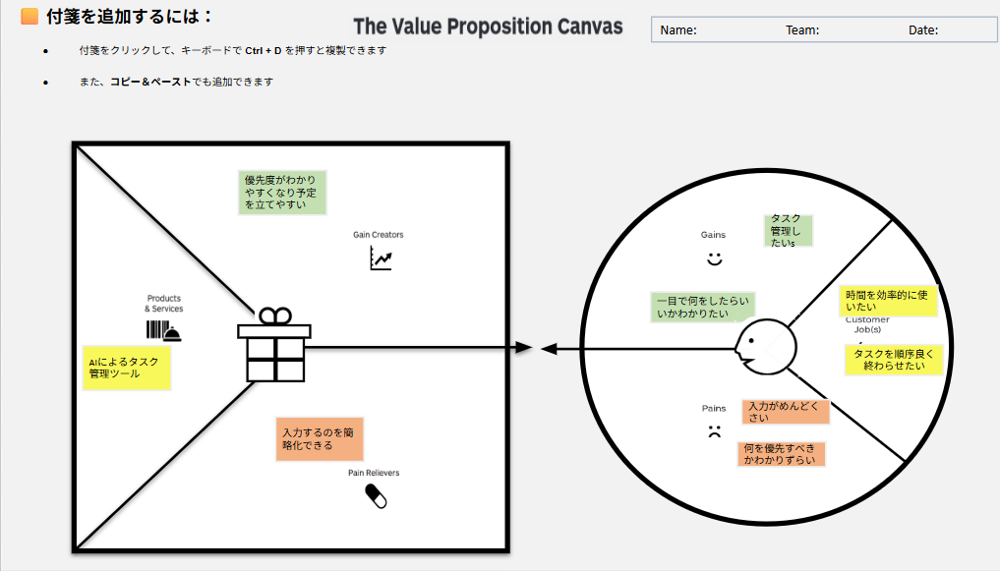

# VPC v1

## 顧客像 (Customer Segment)

### 顧客の仕事 (Customer Jobs)
- タスク管理したい
- タスクを順序良く終わらせたい
- 時間を効率的に使いたい

### 悩み (Pains)
- 入力がめんどくさい
- 何を優先すべきかわかりづらい

### 喜び (Gains)
- 一目で何をしたらいいかわかりたい

## 解決策 (Value Proposition)

### 製品・サービス (Products & Services)
- AIによるタスク管理ツール

### 悩みの解消 (Pain Relievers)
- 入力するのを簡略化できる

### 喜びの創出 (Gain Creators)
- 優先度がわかりやすくなり予定を立てやすい
